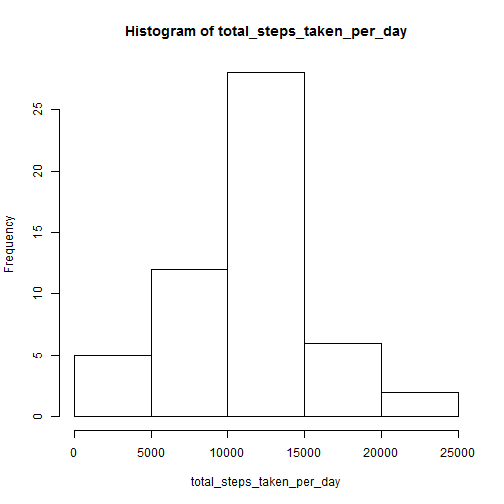
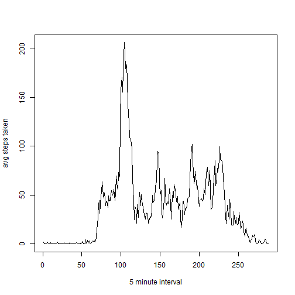
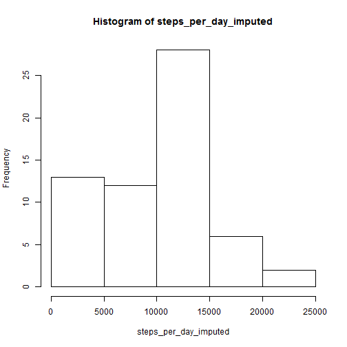
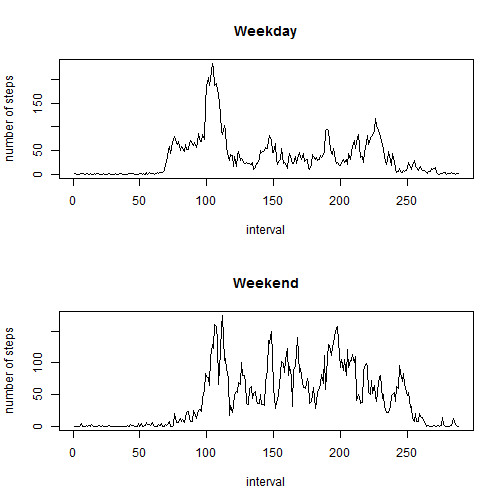

## Loading and preprocessing the data

```r
x = read.csv('activity.csv')
```


## What is mean total number of steps taken per day?

```r
total_steps_per_day = sum(x$steps, na.rm = TRUE)/61
sprintf('Total number of steps per day: %s',total_steps_per_day)
```

```
## [1] "Total number of steps per day: 9354.22950819672"
```


```r
total_steps_taken_by_day = tapply(x$steps, x$date, sum, na.rm = TRUE)
hist(total_steps_taken_per_day)
```

 

## What is the average daily activity pattern?

```r
mean_steps_per_day = mean(total_steps_taken_per_day, na.rm = TRUE)
median_steps_per_day = median(total_steps_taken_per_day, na.rm = TRUE)
sprintf('Mean steps per day: %s', mean_steps_per_day)
```

```
## [1] "Mean steps per day: 10766.1886792453"
```

```r
sprintf('Median steps per day: %s', median_steps_per_day)
```

```
## [1] "Median steps per day: 10765"
```


```r
avg_steps_taken_by_interval = tapply(x$steps, x$interval, mean, na.rm = TRUE)
plot(avg_steps_taken_by_interval, type = 'l',xlab = '5 minute interval', ylab = 'avg steps taken')
```

 


```r
index = avg_steps_taken_by_interval == max(avg_steps_taken_by_interval)
max_steps_interval = names(avg_steps_taken_by_interval[index])
sprintf('Interval with highest average steps: %s', max_steps_interval)
```

```
## [1] "Interval with highest average steps: 835"
```

## Imputing missing values
Replaced missing values with the median value of the entire dataset.  
Then created a histogram after the missing values were imputed.

```r
x_imputed = x
x_imputed$steps[missing] = median(x$steps,na.rm = TRUE)
steps_per_day_imputed = tapply(x_imputed$steps, x_imputed$date, sum)
hist(steps_per_day_imputed)
```

 

```r
sprintf('Mean steps per day: %s', mean(steps_per_day_imputed))
```

```
## [1] "Mean steps per day: 9354.22950819672"
```

```r
sprintf('Median steps per day: %s', median(steps_per_day_imputed))
```

```
## [1] "Median steps per day: 10395"
```
Looks like imputing values *reduced* the mean and median number of steps per day


## Are there differences in activity patterns between weekdays and weekends?
Yes. It appears the weekend has more activity throughout the day whereas weekdays  
see a spike in the morning then slow down. This makes sense given the commute to work.


```r
x$date = as.Date(x$date)
day_type_index = weekdays(x$date) %in% c("Saturday","Sunday")
day_type = day_type_index
day_type[day_type_index] = "Weekend"
day_type[!day_type_index] = "Weekday"
day_type = as.factor(day_type)
x$day_type = day_type
x_weekday = x[x$day_type == 'Weekday',]
x_weekend = x[x$day_type == 'Weekend',]
weekday_avg = tapply(x_weekday$steps, x_weekday$interval, mean, na.rm = TRUE)
weekend_avg = tapply(x_weekend$steps, x_weekend$interval, mean, na.rm = TRUE)
par(mfrow = c(2,1))
plot(weekday_avg, type = 'l', main = 'Weekday', ylab = 'number of steps', xlab = 'interval')
plot(weekend_avg, type = 'l', main = 'Weekend', ylab = 'number of steps', xlab = 'interval')
```

 
